<!-- Canonical talk source (moved here from Google Drive, 2026-07-01). Figures live in
     ../../web/public/images/ (shared with the web app; not duplicated).
     Kept in sync by hand with ../../web/public/talk.html (the hosted reveal.js deck served at /talk):
     same slide order and content.
     Render with Marp (VS Code "Marp for VS Code" extension, or: marp master_presentation.md -o deck.pdf). -->
---
marp: true
paginate: true
theme: default
title: "All You Need is QaL: The Crisis in Academic Publishing"
---

<!-- _class: lead -->
# All You Need is Q*a*L

**The Crisis in Academic Publishing**

*Symptoms, Diagnoses, and a Potential Solution Concept*

<!-- Title is a deliberate provocation (the Beatles' "All You Need Is Love"; "Attention Is All You Need"). Deliver the qualifiers in the body: QaL is necessary but not sufficient; it needs an integrity floor, must be decided late, must report a reference class and interval, and must be hard to game. -->

Karl T. Ulrich
*(Joint work with Gérard Cachon and Christian Terwiesch)*

July 9, 2026 · OID Department Seminar · The Wharton School

---

## Published Articles are the Coin of the Realm

- Unit of work in academia
- Vary widely in embodied effort
- "Refereed" journal an important categorization
- "A journal" the most important categorization
- "Quality" matters, but assessing quality is tricky

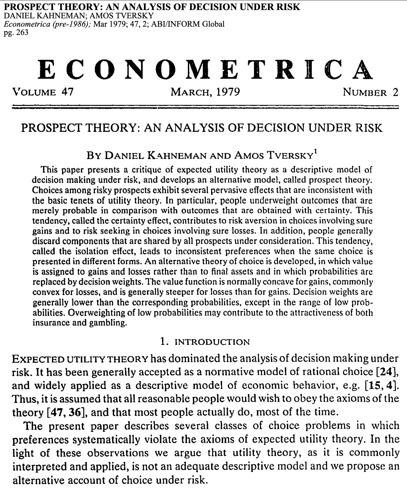

<!-- Kahneman & Tversky, "Prospect Theory," Econometrica 47(2), 1979. Nobel-recognized, foundational, top journal: the article as coin of the realm. -->

---

## What We Mean by Quality

- Many dimensions of quality: interestingness, importance, impact, novelty, elegance, humor, clarity, rigor, popularity, methodological purity, and so on
- For the system, we collapse them to a single scalar **Q**, the eventual recognized value of the work; correctness and importance are *inputs* to Q, not separately certified axes
- Ex ante uncertainty about Q is high
- Review effort narrows that uncertainty only modestly; **time reveals most of it**
- A finer two-dimensional view, separating correctness C from impact I, is a useful extension we keep as a branch

Cachon, Girotra & Netessine (2020), "Interesting, Important, and Impactful Operations Management," M&SOM 22(1)

---

## Many Available Metrics for Q; Authority-Weighted Citations ("PageRank") Likely Pretty Good

- Estimate **Q from realized impact**: the percentile, within field and vintage, of citation count — excluding self-citations (or authority-weighted citations, essentially PageRank)
- A confidence interval for Q begins at **[0, 100]**; one citation moves it to about **[50, 100]**; with enough evidence it narrows, e.g., **[82, 84]**
- No single number is needed: a wealth of independent signals is measurable, and they accrue over time
- The more independent the signals, the less the estimate of Q can be gamed

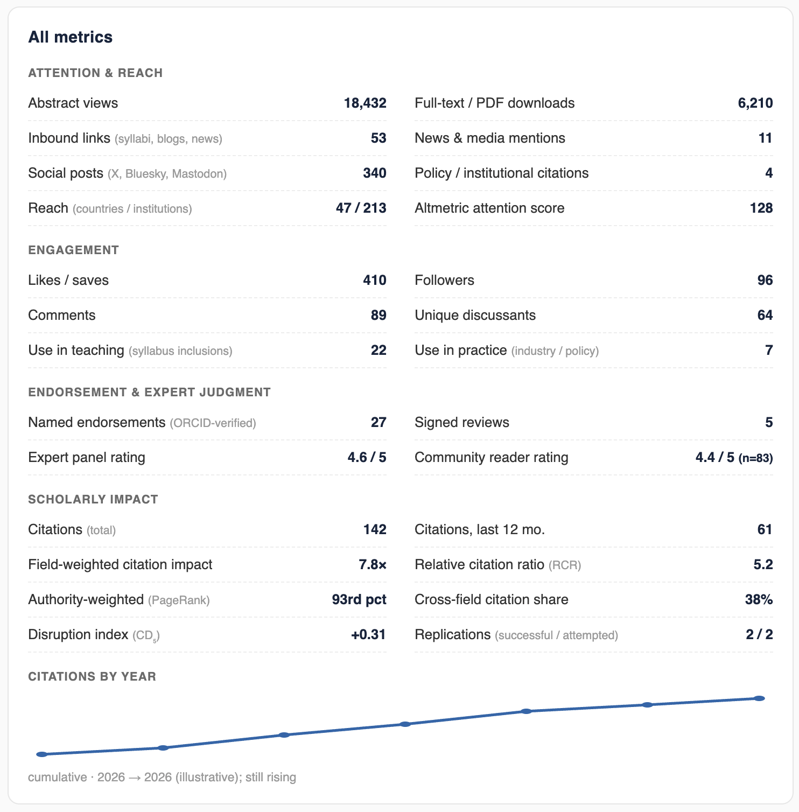

---

## The Distribution of Q Is Heavy-Tailed (and the Mode is 0)

Quality Q, proxied by citation-based impact.

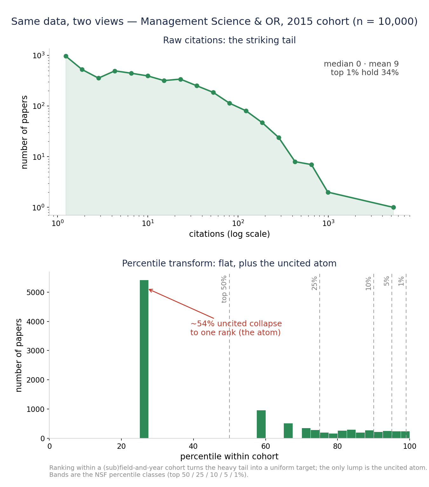

Management Science & OR, OpenAlex (all journals), published 2015, cited through 2026; n=10,000. ~48% uncited, median 1, yet the top 1% hold 27% of all citations. Psychology is essentially identical (median 0, ~53% uncited, σ≈1.5, top 1%≈26%): citation distributions are universal across fields.

Radicchi, Fortunato & Castellano (2008), *PNAS* 105(45):17268–17272; Brzezinski (2015), *Scientometrics* 103(1):213–228; Thelwall (2016), *Journal of Informetrics* 10(2):336–346.

---

## Reporting Q as a Percentile Class

- Raw citation counts are heavy-tailed and hard to compare across fields and years
- Transform each paper to its **percentile within its own field and publication year**
- Report membership in standard classes: **top 1%, 5%, 10%, 25%, 50%**
- These are the NSF / Leiden percentile classes, a standard in research evaluation
- About half of all papers sit at or near zero citations: an atom at the bottom

A percentile is intuitive, field-fair, and robust to the tail. The Ledger's tiers map onto these classes.

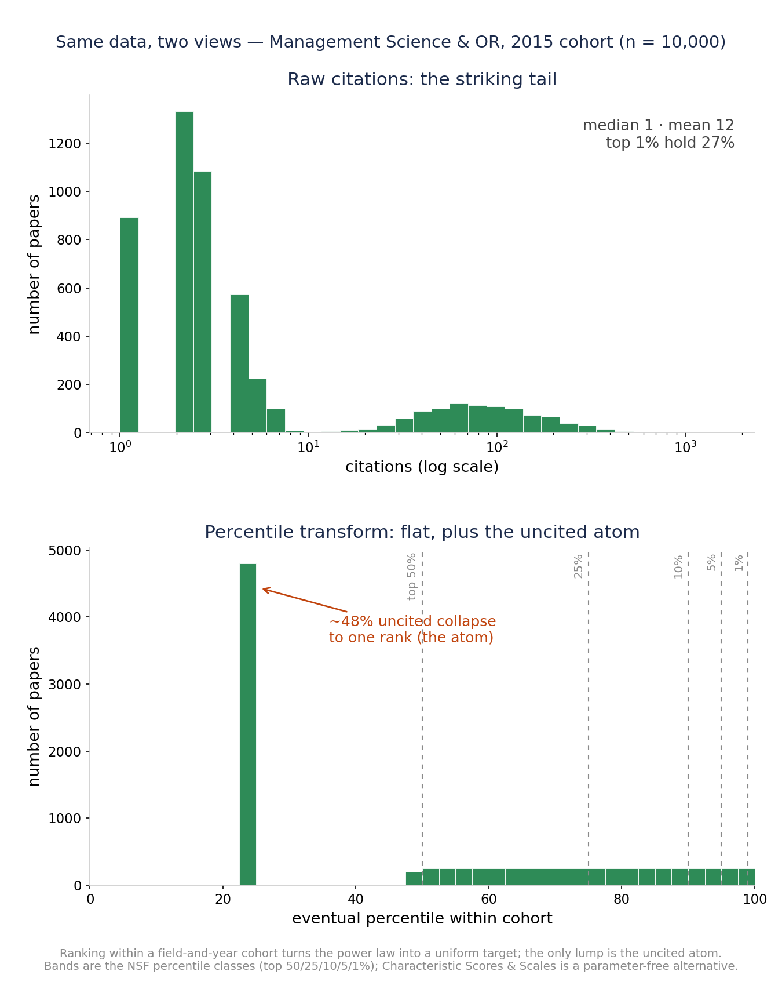

Percentile classes: National Science Board, *Science & Engineering Indicators* (NSB-2025-7); CWTS Leiden Ranking. Parameter-free alternative: Glänzel & Schubert (1988), "Characteristic Scores and Scales in Assessing Citation Impact," *Journal of Information Science* 14(2):123–127.

---

## Designing Q*a*L: Composition and Choices

**How it is composed**

- A blend of **robust, article-level, field-and-vintage-normalized** signals, never a raw count
- Spine: the paper's **percentile within field and publication year** (NSF / Leiden classes)
- Topic heat handled by **co-citation-neighborhood normalization** (Relative Citation Ratio) and field-normalized scores (Leiden MNCS)
- **Authority-weighted** citations (PageRank-style), harder to game than raw counts
- Correctness signals fold in over time: replications, corrections, retractions
- Reported as a point estimate, a 90% interval, and bucket probabilities, decided late

**Design questions**

- **Transparent or opaque?** Transparent method and inputs, auditable and reproducible; opaque metrics breed distrust. Gaming-resistance comes from *design*, not secrecy: many independent signals, authority-weighting, a percentile basis, and deciding late
- **Field-normalized how?** Within field × vintage, plus article-level co-citation normalization; the reference class is always stated
- **Proven, robust tools to invoke:** percentile classes, field-normalized scores (MNCS), the Relative Citation Ratio, Characteristic Scores and Scales — not the article-level Journal Impact Factor

Responsible-metrics principles: Hicks, Wouters, Waltman, de Rijcke & Rafols (2015), "The Leiden Manifesto for research metrics," *Nature* 520:429–431; DORA (2013). Article-level normalization: Hutchins, Yuan, Anderson & Santangelo (2016), "Relative Citation Ratio," *PLoS Biology* 14(9):e1002541; CWTS Leiden Ranking (MNCS); Glänzel & Schubert (1988).

---

## Estimates of Q Can Be Accurate After a Little Calendar Time

The early signal is real: working-paper citations, downloads, and views are available within a year and already forecast eventual citation impact.

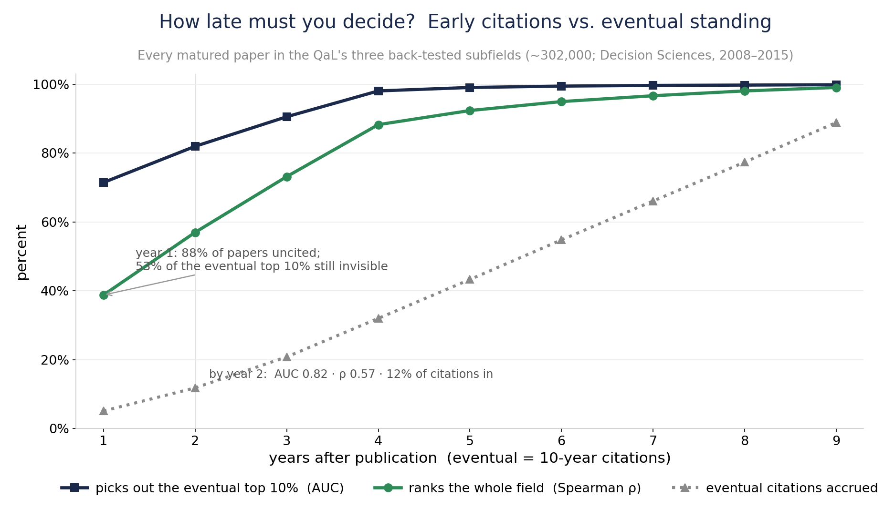

▶ Open the live Citation Race: academicledger.vercel.app/index.html

Early downloads predict later citations: in arXiv physics (N = 14,442 in high-energy physics) the download–citation correlation is r ≈ 0.42, and downloads measured at **6 months** predict 2-year citation impact about as well as a full two years of data — Brody, Harnad & Carr (2006), *JASIST* 57(8):1060–1072. A prospective study of 153 *BMJ* papers found the same (hits–citations r ≈ 0.5) — Perneger (2004), *BMJ* 329:546–547.

<!-- r ≈ 0.4 explains roughly 16% of the variance in eventual citations, and the predictive signal plateaus by about 6 months: informative early, far from determinative, which is exactly why the Ledger decides late. Year 1 finds only about half of the eventual top ten. -->

---

## The Societal Functions of Publishing

- **Administration**: time stamp, copy edit, typeset, archive, distribute
- **Development**: peer feedback and guidance for revision
- **Promotion**: communicating existence to the relevant audience
- **Certification of quality**: some of it knowable early, most revealed over time

**Historically, Journals Performed All of these Functions**

- Most functions (except development) were completed nearly **simultaneously**, around the time of "publication"
- Today the functions are increasingly **unbundled** (SSRN, arXiv, personal sites, social media, DIY publication-quality document prep, LLM copy editing)
- Distribution is now largely irrelevant (PDF downloads, SSRN, open access)

The functions of scholarly communication were canonically identified as registration, certification, awareness, and archiving by Roosendaal & Geurts (1997), "Forces and Functions in Scientific Communication"; the case for *unbundling* (decoupling) them into independent services was made by Priem & Hemminger (2012), *Frontiers in Computational Neuroscience* 6:19.

---

## Pre-Publication Peer Review Cannot Do the Job, for Two Reasons

**1. The instrument is noisy**

- Inter-rater reliability is low: 2–3 reviewers give a verdict little better than a guess
- Reliability rises only slowly with more judges; you would need >10 to dependably classify a marginal paper
- *Fixable in principle*: add judges (Spearman–Brown)

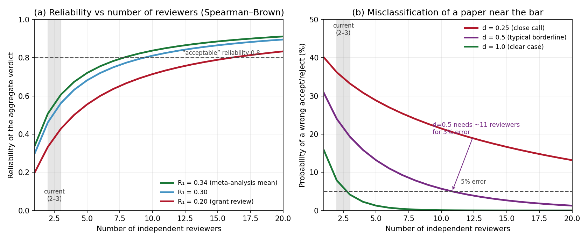

**2. The target is mostly exogenous**

- Even a perfect read on a paper's knowable quality predicts little of its eventual Q
- Most of what determines eventual Q — timing, attention, who cites whom — is realized **after** the decision
- *Not fixable* by any number of judges

**Reason 1 limits any small panel. Reason 2 limits any ex ante process, however many reviewers it uses.**

---

## A Simple Model, with Evidence for Each Parameter

Eventual quality decomposes into a knowable component plus an exogenous shock; each reviewer sees the knowable component through noise:

<i>Q</i> = <i>q0</i> + <i>u</i> &nbsp;·&nbsp; <i>si</i> = <i>q0</i> + <i>ei</i>

| Parameter | Value | Evidence |
|---|---|---|
| **Reviewer noise** (reliability of one review) | ICC ≈ 0.34 | Bornmann, Mutz & Daniel (2010), *PLoS ONE* 5(12):e14331 (48 studies, 19,443 manuscripts); Cicchetti (1991), *Behavioral & Brain Sciences* 14(1):119–186; NeurIPS revisit, ~50% of scoring subjective — Cortes & Lawrence (2021), arXiv:2109.09774 |
| **Validity ceiling** (knowable quality → eventual Q) | R² ≈ 0.06 | Success in cumulative-advantage markets is intrinsically unpredictable — Salganik, Dodds & Watts (2006), *Science* 311:854–856; review scores do not predict citations of accepted papers — Cortes & Lawrence (2021); impact often realized years later ("sleeping beauties") — Ke, Ferrara, Radicchi & Flammini (2015), *PNAS* 112(24):7426–7431 |

*q0* = the knowable (ex ante) component of quality; *u* = the exogenous shock realized after the decision, so eventual quality *Q* = *q0* + *u*; *ei* = reviewer error. A review recovers at best *q0*; even perfectly, it explains only about 6% of *Q*. Outcomes are binned into the NSF percentile classes; the validity ceiling is sourced from the publishing literature, not from our own idea-evaluation work.

---

## The Result: More Reviewers Barely Help

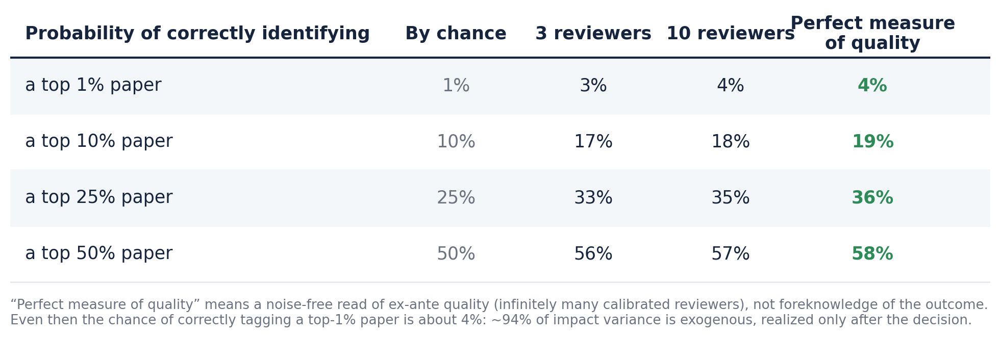

Probability a paper that truly belongs in a tier is placed there, under the model above (ICC 0.34; validity ceiling R² 0.06). "Perfect measure of quality" is a noise-free read of ex ante quality, not foreknowledge of the outcome. Going from 3 to 10 reviewers barely moves the numbers: the validity ceiling, not reviewer count, is the binding constraint.

---

## The System has Always been Infuriating; It May Be Getting Worse

- Supply is increasing dramatically

  - LLM use in writing
  - Co-authorship inflation (no obvious net effect on the number of papers)

- Submissions to *Organization Science* up **42%** since ChatGPT (a COVID bump was 20%), almost entirely AI-generated text
- Of the most AI-heavy manuscripts (70%+), ~70% are desk-rejected, vs 44% for low-AI
- Reviewers increasingly rely on LLMs for referee reports (a "shadow AI review system")

  - Does not necessarily make the system worse, but we can probably use AI more deliberately
- Anecdotally, time to first review is increasing, but variance across journals is very high

Pierce, Gartenberg, Murray & Hasan, "More versus Better," Organization Science (2026)

<!-- Org Science AI Task Force; Lamar Pierce is EIC. Full paper DOI 10.1287/orsc.2026.ed.v37.n3. -->

---

## Stakeholder Needs - Academic Publishing System

- Credibly certify correctness, avoiding false negatives
- Provide reliable, unbiased, hard-to-game evidence of impact
- Minimize the time from submission to "reviewed publication" CV status
- Allow papers to be "reviewed/published" while minimizing unproductive author effort
- Engage the community in discovery, discussion, and constructive feedback
- Embrace revision over time with a transparent history and serving the latest version

- Exhibit grace towards low-citation papers and authors (the vast majority of the field)

- Enable easy search and retrieval

- Operate sustainably

  

  *A cursory tour of academic forums (Hacker News, r/AskAcademia, r/professors) turns up every one of these, in far more colorful form.* On what the community wants: Mulligan, Hall & Raphael (2013), *JASIST* 64(1):132–161; Ithaka S+R *US Faculty Survey* (2021).
---

## The Journal System Could Possibly Be Fixed

- We have faced long lead times and Reviewer 2 essentially forever. Not a new problem.
- Tightly run journals with committed editors still seem to function reasonably well
- "AI will save us" is the optimistic branch, but the evidence is mixed and the prospects are genuinely uncertain
- LLMs are useful *assistants*: on realistic tests they catch only a minority of real or inserted errors, miss broken logic, can be gamed by hidden prompts, and skew lenient
- They are strongest at triaging and improving reviews, weakest at identifying the very best work and at grounded technical verification
- A diverse **ensemble** (the Galton move) may raise the floor cheaply, but the evidence does not yet support replacing human judgment
- Still, journals could use LLMs for an initial filter to push net submission rates toward pre-LLM levels

LLMs catch only roughly 20–40% of real or inserted errors and can miss broken logic entirely: Son et al. (2025, SPOT, arXiv:2505.11855); Xi et al. (2025, FLAWS, arXiv:2511.21843); Dycke & Gurevych (2025, arXiv:2508.21422). Useful as assistance: Liang et al. (2024), *NEJM AI* 1(8). Gameable by hidden prompts: Gibney (2025), *Nature* 643:887–888. On the ensemble idea: Meincke, Terwiesch & Huchzermeier (working paper).

---

## An Alternative Approach: The Academic Ledger

- A neutral, non-profit *system of record* applies a light integrity screen **immediately** and certifies the work, without judging quality
- Then evidence of quality **accumulates over time**, and the branding of recognition occurs with some delay, when confidence in the estimate of Q is high
- Journals continue to exist and may remain important for branding, but the Ledger is the source of truth about quality

---

## Three Sequential Categories of Papers: Certified, Refereed, Canon

- **Certified.** Authenticated by ORCID (the primary filter) and screened by automated tools and LLMs for fraud and obvious defects, not correctness, then archived, timestamped, and public within days. A floor against fraud and the obviously wrong, not a claim about quality. Fast and near-automatic; perhaps 1–5% are rejected.
- **Refereed.** Has earned named, signed reviews or endorsements from identified scholars above a published threshold. The tier that honestly merits the classification "peer reviewed," but in the open and on the record. Perhaps the standard is 90% confidence that the paper will eventually reach the 75th percentile of submissions.
- **Canon.** The curated, time-earned best, conferred from realized impact (use, citation, replication, discussion) and signed endorsements, by field panels under published criteria. Quality judged after the fact from evidence, not predicted. Perhaps approximately the 95th percentile of papers. Because it rests on evidence rather than a noisy verdict from two or three reviewers, it should in theory be more valuable than journal acceptance.
- **Published.** Optional nice-to-have curation via publication in a journal. Publication could, but need not, follow from the evidence.

One record: a CV line begins as *Certified* and is upgraded in place to *Refereed*, then *Canon*, as review and impact accrue. A credential that only appreciates.

---

## The Certification Screen Should be a Low Bar

- **Certified does not judge quality.** It verifies identity and screens out fraud and the obviously wrong, nothing more
- **Identity is the primary filter:** ORCID authentication raises the cost of paper-mill, sock-puppet, and fabricated-author submissions
- The automated and LLM screen targets a deliberately narrow set: fabrication, manipulated figures, paper-mill and "tortured phrase" text, fabricated or dead citations, gross statistical inconsistencies, and claims with no support
- Much of this is handled by **validated rule-based tools** (image-duplication, statcheck, tortured-phrase and paper-mill detectors), with LLMs for triage. This is a low bar the evidence can support, unlike judging quality, which it does not attempt
- Expected outcome: outright rejection of perhaps **1–5%** of ORCID-authenticated submissions
- **Prefer conditional certification:** admit borderline work with an attached, transparent summary of the LLM-generated concerns, and leave judgment to readers and to the later tiers

LLMs cannot yet reliably certify correctness (Son et al. 2025, SPOT; Xi et al. 2025, FLAWS; Dycke & Gurevych 2025) and are gameable (Gibney 2025, *Nature* 643:887). The screen is therefore scoped to fraud and obvious error, where rule-based tools (statcheck; image-duplication; tortured-phrase and SCIgen detectors) are already effective.

<!-- The design deliberately does not rely on LLMs for correctness. The bar is fraud and the obviously wrong; everything else is admitted, optionally with disclosed concerns, and importance is decided later from evidence. -->

---

## The Same Paper, Several Ways

`[Certified]`  Cachon, G., C. Terwiesch, and K. Ulrich. 2026. The Crisis in Academic Publishing. *Academic Ledger* [0, 100]. https://doi.org/10.59312/aldg.2026.0427

`[Refereed]`  Cachon, G., C. Terwiesch, and K. Ulrich. 2026. The Crisis in Academic Publishing. *Academic Ledger* [75, 100]. https://doi.org/10.59312/aldg.2026.0427

`[Canon]`  Cachon, G., C. Terwiesch, and K. Ulrich. 2026. The Crisis in Academic Publishing. *Academic Ledger* [95, 100]. https://doi.org/10.59312/aldg.2026.0427

`[Canon]` Ⓟ Cachon, G., C. Terwiesch, and K. Ulrich. 2026. The Crisis in Academic Publishing. *Academic Ledger*. (also appears in Quantitative Science Studies 7(2):512–540, 2026). https://doi.org/10.59312/aldg.2026.0427

One record, one DOI, one act of authorship: the line is upgraded in place; the circled P flags the journal-published version, with its citation appended.

<!-- The example is this talk. The journal citation and DOI are fabricated for illustration, not real. Quantitative Science Studies is a real, well-fit venue (MIT Press, community-owned), used here illustratively. -->

---

## What the Paper Record Looks Like on academic Ledger

[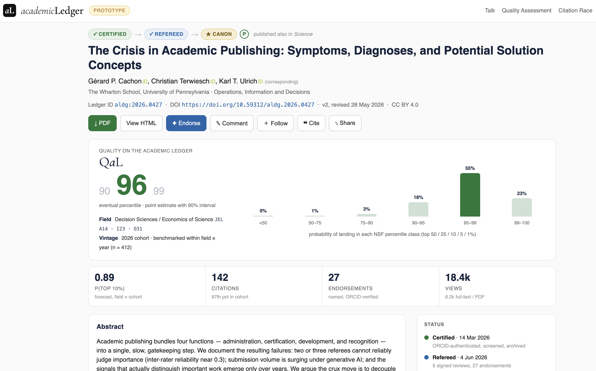](https://academicledger.vercel.app/paper.html)

A paper's home on the Ledger: tier status, the journal-published flag, and impact that accrues over time. Open the live page: academicledger.vercel.app/paper.html

---

## The Journal Perspective

- The Ledger is consistent with the policies of most academic journals in social science
- Journals could encourage authors to **first publish on the Ledger**, reducing their volume of low-quality submissions
- The alternative to a hard reject could become "develop the work on the Ledger"
- Editors could proactively scan the Ledger for work to invite, evaluating fit and quality based on evidence

---

## How Is This Not Just SSRN?

- SSRN is a for-profit, owned by Elsevier (a journal publisher), with conflicted incentives
- SSRN is a **posting service, not a system of record**
- SSRN, despite offering its own branded metric (PlumX), deliberately avoids an honest estimate of Q
- It confers no credential that "counts," its download metrics have been gameable, and are reported only as a running cumulative total
- The Ledger adds what SSRN lacks: neutral non-profit governance, an identity and integrity layer, signed review, "refereed" status, and an evidence-based estimate of Q in percentile terms

<!-- Drafted to answer Karl's heading; adjust freely. -->

---

## Could an Incumbent Implement the Ledger?

- An incumbent doing this well would be a **win, not a loss**. The aim is the system of record with a credible estimate of Q, by whatever means best realizes the goals.
- What a record requires: **neutral, non-commercial governance**, permanence, coverage of all fields, an identity and integrity layer.
- Barriers for anyone: the cold start (authors and endorsers together); recognition still locked to journal names and the impact factor; cross-field scope; durable funding; each incumbent's own inertia.

| Player | Strengths as a record | Weaknesses / risk |
|---|---|---|
| **arXiv** (independent non-profit, from Jul 2026) | Neutral, trusted, built to last; already spans physics to economics | Identity tied to physics/math/CS; no endorsement, curation, or metrics layer |
| **SSRN** (for-profit; Elsevier, 2016) | Deep social-science adoption and author base | Owned by a journal publisher; conflicted; wrong steward for a neutral record |
| **bioRxiv / medRxiv** (openRxiv, non-profit, 2025) | Strong governance, fast growth, well funded (CZI) | Life and health sciences only |
| **eLife** (non-profit journal) | Already layers signed review on preprints (our Refereed idea) | A journal, life-science scope; lost its impact factor when Clarivate balked |
| **Octopus** (UKRI-funded non-profit) | Explicitly a "new primary research record" | Radical unit-of-research model; thin adoption; UK-centric |
| **Big publishers** (Elsevier, Springer Nature, Clarivate) | Scale, money, distribution | Most conflicted; their economics oppose decoupling |

Adjacent pieces exist but none certify or curate: OpenAlex, Crossref, ORCID (non-profit data and identity); Google Scholar, Semantic Scholar (discovery); ResearchGate (for-profit network).

---

## Cold Start and Graceful Evolution

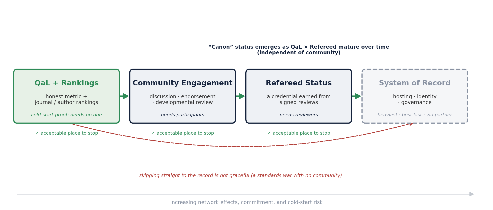

Four non-overlapping feature sets, drawn as states. **QaL + Rankings** is cold-start-proof and bootstraps the rest; **Community Engagement** supplies the reviews that earn **Refereed Status**; the **System of Record** is heaviest and comes last. Each of the first three is an acceptable place to stop, so the system stays additive to SSRN, arXiv, and journals and degrades gracefully. Canon is not a separate set: it emerges as QaL and Refereed mature.

<!-- Most graceful path: QaL+Rankings, then Community Engagement, then Refereed Status, then System of Record. Each transition is enabled by the prior state and independently valuable; the only ungraceful move is jumping early to the record. The one hard step is Community to Refereed (reviewer supply): seed one field with reputation-credited signed reviews, reciprocity, and LLM-assisted developmental drafts with a human accountable. -->

---

## Open Questions

- Actual development of QaL: How well can Q be estimated, and how early?
- Does the system require radical change, or could the incumbents address the pain points?
- How network-y is the Ledger? (Should there be just one Ledger?)
- Could an institution host the Ledger (e.g., "academic Ledger is hosted by the Wharton School of the University of Pennsylvania")?
- What is the unit of work? (papers, books, videos, other)
- What resources are required to operate the Ledger at scale?
- Could the Ledger be self-sustaining on fees? What other business models are there?
---

## OTHER STUFF
---

## Wine, the 100m Dash, Galton's Ox, and Figure Skating

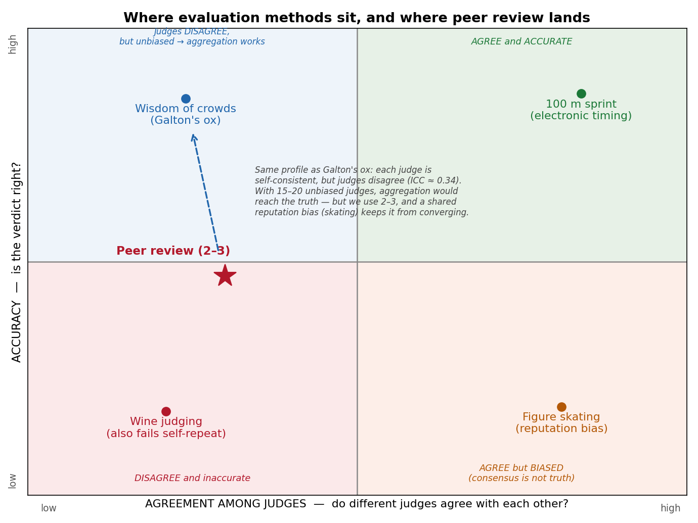

<!-- The x-axis is agreement AMONG judges (inter-rater), not whether one judge repeats herself.
     Sprint: an instrument reads a real quantity; judges agree and the verdict is true.
     Galton's ox: judges disagree, but each is self-consistent and unbiased, so the crowd average converges. The one cell where more judges buys accuracy.
     Figure skating: judges agree, yet share a reputation prior (Findlay & Ste-Marie 2004); shared bias does not cancel.
     Wine: judges disagree AND cannot reproduce their own scores (Hodgson 2008); no stable signal to recover.
     Peer review: same profile as Galton (ICC ~0.34), dragged below by 2-3 judges and a shared reputation bias. -->

---
## Utopia

- Administration is smooth and fast: register, screen integrity, archive, timestamp, and disseminate within days
- True signals of quality emerge **smoothly and continuously** as the field reads, uses, cites, and endorses; those signals are used for critical decisions in universities
- Authors can **respond, adapt, and improve** the work, with the revision history on the record
- Journals become nice-to-have *curation*; the revealed evidence is what matters for reputation and for evaluating scholarship
- A more predictable, less capricious, less arbitrary world for emerging scholars; senior scholars with no patience for journals can opt out and still "publish"

---

## Modest Success ("SSRN/arXiv+")

A realistic near-term target: a system of record, plus…

- An automated fraud and integrity screen (a low bar, not full correctness) and certification
- Community engagement, discussion, and endorsements
- A comprehensive set of impact metrics
- An estimate of Q in percentile terms, e.g., a 90% confidence interval [83, 90]
- A designation of "refereed" that allows the work to "count"

---

## The Cold-Start Problem

- Posting on the Ledger is **no-regrets** for all authors
- A founding board (N ≈ 100) commits to (a) posting their work and (b) providing N endorsements
- Leading journals add language to their instructions to authors
- Institutional authority lends credibility (Wharton, INFORMS, and so on)
- To start, all existing work could be scraped, indexed, analyzed, and reformatted

---
## Sketch of a Model for Establishing System Parameters

- Eating our own dogfood: can a model usefully inform this system?
- A scalar quality **Q** with a **heavy-tailed** distribution (most value sits in the tail)
- A low-bar integrity gate at entry, then estimation of Q from accumulating evidence; the real decision is *when* to certify each tier
- Targets a chosen level of false negatives and false positives, under a validity ceiling on early prediction
- A two-dimensional (C, I) treatment is a useful extension we keep as a branch

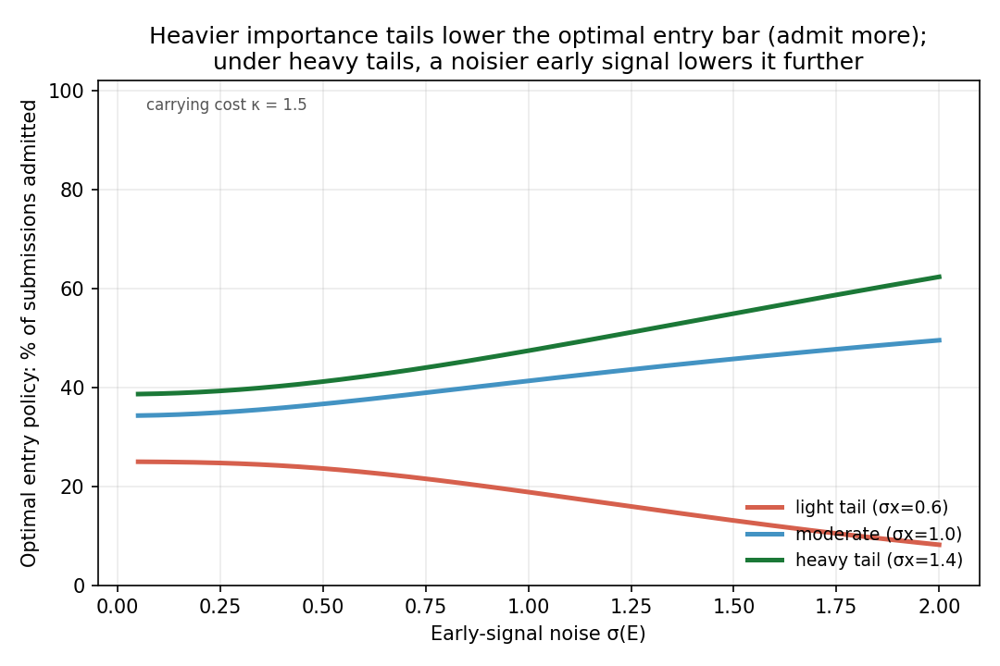

▶ Open the live belief-about-eventual-percentile model: academicledger.vercel.app/quality-percentile.html · 2D (C, I) extension: academicledger.vercel.app/quality.html
